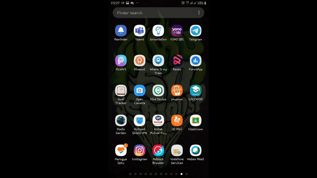

# Whatsapp-Twilio-Backend
#### This Repository contains the code for developing a whatsapp application using Twilio and Whatsapp Sandbox.  
#### Project Video - https://youtu.be/ABdhxErtkH4    
This project helps to calculate the amount of money people are donating to PM-CARES fund (Prime Minister's Citizen Assistance and Relief in Emergency Situations Fund ) during the period of Lockdown.  
This WhatsApp application allows the users to send a screenshot or a pdf, as a WhatsApp message, of the payment done to the fund from 9 specific locations. The application takes the user media input and processes the image to evaluate the amount automatically using Computer Vision Techniques.  
Also, this application has a functionality of finding weather the user has downloaded the "Arogya Setu" App in his mobile device or not. For this, the user has to send the screenshot of his mobile screen where the app is present.  

  
## Payment
   
## Arogya-Setu App
  
## Dashboard
    

### Test Database
You can check the database at - 

### For setting up the project
1. You have to set up Twilio Account.
2. You need to set up Whatsapp Sandbox for Twilio.
3. For setting up google sheets as a test database, you need to activate google api for sheets and update app.py.
4. For image/pdf/other-media data, you need to modify the app.py accordingly.
5. I have set up 9 accounts on twilio, you can try using only one. Modify the if statements Account SID section in app.py.
6. After Deploying app.py to a web server (I have deployed on , you can also try using ngrok)
7. After deployment, copy the '<deployment-url>/whatsapp endpoint' and paste in Twilio Whatsapp Sandbox console -   
  where its mentioned, **when a message comes in**.
  
## If you have any problems in setting up, just ping me on **[bhatia.ankur24@gmail.com](bhatia.ankur24@gmail.com)**
